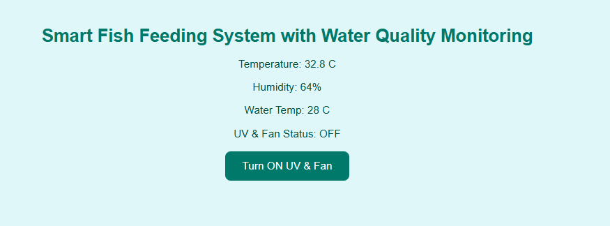
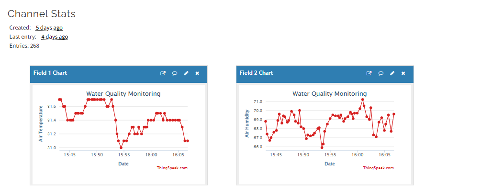

# 🪰 Smart Bug-Attracting IoT System  
### An ESP32-based Environmental Bug Monitoring & Control Device  
Designed & Built by **Ishat Noor Mahi**

---

## 🌟 Features

- 🌡️ Real-time monitoring of:
  - Air temperature & humidity (DHT22)
  - Water temperature (DS18B20)
  - Light intensity (LDR + ADS1115)
- 📶 Wireless data transmission to **ThingSpeak**
- 💡 Remote control of:
  - UV-simulating LEDs
  - Cooling fan to attract and trap insects
- ☀️ Solar-powered with 6V 3W panel & TP4056 charger
- 🔋 Power optimization using MP1584EN buck converter

---

## 🛠️ Components Used

| Component               | Quantity | Purpose                                  |
|-------------------------|----------|------------------------------------------|
| ESP32 WROOM-32 Devkit V1 | 1        | Main microcontroller                     |
| DHT22                   | 1        | Temperature & humidity sensor            |
| DS18B20                 | 1        | Water temperature sensor                 |
| LDR + ADS1115 Module    | 1        | Light sensing with high precision        |
| TP4056 Charger Module   | 1        | Li-ion battery charging                  |
| MP1584EN Buck Converter | 1        | Voltage step-down to 3.3V                |
| GPIO Expander           | 1        | Additional digital IO                    |
| Logic Level Converter   | 1        | 5V ↔ 3.3V interfacing                    |
| UV LEDs (simulated)     | 2–4      | Light source to attract insects          |
| Cooling Fan             | 1        | To pull insects inside                   |
| 6V 3W Solar Panel       | 1        | Off-grid power supply                    |
| Li-ion Battery (3.7V)   | 1        | Power storage                            |

---

## 🔌 Wiring Diagram (Simplified)

DHT22 → GPIO 14 (with 10k pull-up)
DS18B20 → GPIO 4 (OneWire)
LDR → ADS1115 A0
ADS1115 → I2C (SDA: GPIO 21, SCL: GPIO 22)
Fan → GPIO 26 (via MOSFET)
LEDs → GPIO 27
TP4056 → Battery + Solar Panel
MP1584EN → Output to ESP32 3.3V rail

---

## 📸 Screenshots / Photos

> 
> 

---

## 🚀 How to Use

1. Upload the code from `main.ino` or `main.py` (depending on language used) to ESP32
2. Configure your WiFi & ThingSpeak API Key
3. Connect sensors & power supply as per wiring
4. Watch data stream live and control devices remotely!

---

## 🔐 License

This project is licensed under the **CC BY-NC 4.0** license.

> ✅ You **can** use, modify, and share it **for personal or educational use**.  
> ❌ You **cannot** use it **commercially** or resell any part of this project **without written permission**.

© 2025 **Ishat Noor Mahi**  
📧 ishatnoormahi@gmail.com

---

## 🤝 Acknowledgments

- Libraries used: `Adafruit_Sensor`, `OneWire`, `DallasTemperature`, `DHT`, `ThingSpeak`, `ADS1115`, etc.
- Thanks to the open-source community for sensor libraries and IoT support.
